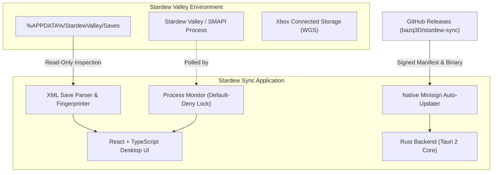
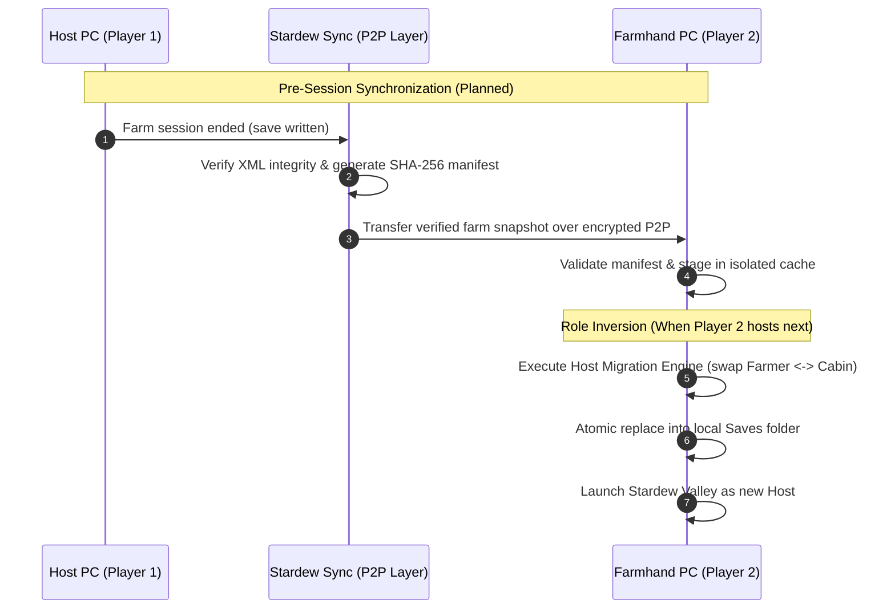

# Stardew Sync

> **Seamless peer-to-peer co-op farm synchronization and host migration for Stardew Valley.**

[](https://github.com/bazq3D/stardew-sync/releases)
[](https://github.com/bazq3D/stardew-sync)
[](https://tauri.app/)
[](https://github.com/bazq3D/stardew-sync)

---

## What is Stardew Sync?

**Stardew Sync** is an experimental Windows desktop application designed to solve a fundamental limitation in Stardew Valley multiplayer: **farm ownership lock-in**.

In Stardew Valley co-op, the host player holds the master farm save file. If the host is unavailable, offline, or busy, the farmhand player cannot continue playing on the same farm with their own character. Manually transferring save files between PCs is tedious, error-prone, and causes desynchronization—especially when playing the **Microsoft Store / Xbox PC Game Pass** edition with Xbox Connected Storage (WGS). Furthermore, simply copying a save folder does not swap the host role: the farmhand would load in controlling the host player's character and inventory, not their own.

Stardew Sync is engineered to make sharing and alternating hosting roles between two co-op players seamless, automated, and safe.

> **Developer:** bazq  
> **Canonical Repository:** [github.com/bazq3D/stardew-sync](https://github.com/bazq3D/stardew-sync)

---

## Project Status

> [!WARNING]
> **Current Status: Early Development / Experimental (`v0.1.3` Published)**  
> Stardew Sync is currently in active pre-release development. Live two-PC peer-to-peer synchronization and automatic in-game host migration are **not yet available**.  
> Published releases currently focus on establishing desktop application infrastructure, dynamic save discovery, save safety guards, and cryptographically verified application auto-updating.  
> **Note on Host Migration:** While offline XML transformations and role-swapping logic have been verified on isolated single-machine test fixtures, these experiments do not establish working two-PC synchronization or live multiplayer role migration.

---

## Current Features

### Available in Published Release (v0.1.3)

- **Local Farm Save Discovery**: Automatically detects standard Stardew Valley save folders in `%APPDATA%\StardewValley\Saves` without hardcoded paths or user assumptions.
- **Save Metadata Inspection & Accurate Host Playtime**: Inspects farm name, in-game calendar date (Season, Day of Month, Year), primary host name, farmhand cabin bindings, and shared wallet balance. Correctly extracts `<millisecondsPlayed>` from the authoritative host entity with decimal hour conversion.
- **Application Localization (i18n)**: Full English (`en`) and Turkish (`tr`) localization with an accessible toolbar language selector and persistent language selection across restarts.
- **Game Process Safety Detection**: Monitors running processes (`Stardew Valley.exe`, `StardewModdingAPI.exe`) to prevent save operations while the game is active.
- **Decoupled Application Auto-Updates**: Decouples application software updates from the game-running lock, allowing Stardew Sync to update safely while Stardew Valley is running (save-critical operations remain strictly protected with fail-closed atomic guards).
- **Production Save Protection**: Employs a strict default-deny read-only security model. Production saves cannot be overwritten or modified by exploratory features.
- **Immutable Snapshot Infrastructure**: Validates baseline save snapshots with cryptographic SHA-256 manifests and schema checks.
- **Signed Application Auto-Updates**: Features native in-app software updates powered by the Tauri 2 updater plugin, cryptographically signed with Minisign Ed25519 keys via GitHub Releases.

---

## Planned Features (Roadmap)

- **Invite-Code Device Pairing**: Connect two player computers using simple, temporary invite codes without configuring port forwarding or static IPs.
- **Encrypted Peer-to-Peer Networking**: Direct PC-to-PC communication over encrypted transport (WebRTC / DTLS / Noise protocol) with no centralized save storage.
- **Automated Save Synchronization**: Compute delta differences and safely transfer the latest farm state before every co-op play session.
- **Intelligent Conflict Detection**: Identify diverged progression or stale saves and provide clean recovery options.
- **Safe Host Migration Engine**: Reorder root host and farmhand identities in the save XML, swap cabin bindings, and transfer inventory ownership seamlessly while preserving all achievements, relationships, and skill levels across two separate devices.
- **Xbox Cloud / WGS Coordination**: Coordinate safe synchronization with Microsoft Store / Xbox Connected Storage.
- **Background Tray Minimization**: Optional subtle background operation to synchronize saves as soon as players finish a gameplay session.

---

## Architecture & How It Works

### Current Local Architecture



### Planned Two-Device Synchronization Flow (Target Architecture)

> **Architectural Note:** The diagram below outlines the target end-to-end workflow planned for future releases. Isolated single-machine XML transformation tests do not constitute working two-device synchronization.



---

## Installation

Download the latest installer from the official release page:

📥 **[Download Latest Release](https://github.com/bazq3D/stardew-sync/releases/latest)**

1. Download `Stardew.Sync_<version>_x64-setup.exe`.
2. Run the installer and follow the setup wizard.
3. Launch **Stardew Sync** from the Start Menu or installation directory.

### Windows SmartScreen & Code Signing Notice
> [!NOTE]  
> Stardew Sync binaries are currently distributed without a Microsoft Authenticode code-signing certificate issued by an established commercial Certificate Authority (CA). As a result, Windows SmartScreen may present an **"Unknown Publisher"** or **"Windows protected your PC"** dialog upon download or initial launch until community reputation is established.  
> 
> As with any third-party executable downloaded from the internet, users should verify the download source and binary integrity before choosing to proceed via **More info** → **Run anyway**.  
> 
> **Tauri Auto-Updater Cryptographic Verification:**  
> Independently from Windows Authenticode reputation checks, all in-app updates downloaded through Stardew Sync's built-in updater are cryptographically verified using **Minisign Ed25519 signatures**. The application updater strictly validates the digital signature against the developer's trusted public key before applying any update package.

---

## Safety & Save Protection Principles

Protecting player gameplay progress is the primary design requirement of this project:

1. **Production Saves Are Never Touched In Pre-Release**: All save-writing and migration capabilities are confined to isolated R&D test slots. Your live production saves (`%APPDATA%\StardewValley\Saves`) remain strictly read-only.
2. **Microsoft Store / Xbox WGS Isolation**: Xbox PC Connected Storage maintains complex binary container indexes (`container.X`, `containers.index`) that sync asynchronously to Microsoft Cloud. Stardew Sync will never alter these indexes until the platform engine has been verified.
3. **Always Back Up Your Saves**: While Stardew Sync implements default-deny safeguards, players are encouraged to maintain independent backups of their `%APPDATA%\StardewValley\Saves` folder before testing any save-management utility.
4. **Transparent Network Activity & No Telemetry**: Stardew Sync contains no analytics, user tracking, or telemetry services. Save files, character data, and personal information are never transmitted to external servers. Active network communication in the current desktop client is limited strictly to checking for signed application updates against the public GitHub Releases endpoint (`https://github.com/bazq3D/stardew-sync/releases/latest/download/latest.json`) over HTTPS when initiated. Future multiplayer synchronization will operate directly between player computers over encrypted peer-to-peer data channels.

---

## Development

### Prerequisites

Ensure the following tools are installed on your Windows development environment:

- **Node.js**: v18.x or v20+ (Node 20+ LTS recommended; [nodejs.org](https://nodejs.org/))
- **Rust**: Latest stable toolchain targeting `x86_64-pc-windows-msvc` ([rustup.rs](https://rustup.rs/))
- **Git**: For source version control ([git-scm.com](https://git-scm.com/))
- **PowerShell**: 5.1 or PowerShell Core (7+)

### Getting Started

Clone the canonical repository:

```bash
git clone https://github.com/bazq3D/stardew-sync.git
cd stardew-sync
```

Install frontend dependencies:

```bash
npm install
```

### Running Locally

Run the frontend in development mode (browser preview):

```bash
npm run dev
```

Run the full desktop application (Tauri development window):

```bash
npm run tauri dev
```

### Building & Verification

Typecheck and bundle the frontend:

```bash
npm run build
```

Run Rust backend checks:

```bash
cargo check --manifest-path src-tauri/Cargo.toml
```

Run targeted backend unit tests:

```bash
cargo test --manifest-path src-tauri/Cargo.toml --test commands_tests
cargo test --manifest-path src-tauri/Cargo.toml --test updater_signing_tests
```

Package the Windows NSIS installer:

```powershell
powershell -ExecutionPolicy Bypass -File scripts\build-release.ps1
```

Publish or validate a GitHub release (requires `gh` CLI):

```powershell
# Safe Dry-Run (validates manifest and cryptographic signatures without remote mutations)
powershell -ExecutionPolicy Bypass -File scripts\publish-github-release.ps1 -DryRun

# Approved Publication
powershell -ExecutionPolicy Bypass -File scripts\publish-github-release.ps1 -Approved
```

---

## Roadmap

| Phase | Milestone | Status | Description |
| :---: | :--- | :---: | :--- |
| **1–3** | Save Engine Core (Local R&D) | **Completed (Offline)** | XML parser, schema preservation, character fingerprinting, and local test-fixture role swap experiments. *(Single-machine tests do not establish two-PC synchronization).* |
| **4** | Disposable Runtime Validation | **Completed** | Production baseline audit, disposable test slot installation, and post-runtime verification. |
| **5** | Desktop App & Auto-Updater | **Completed (v0.1.2)** | Tauri 2 desktop app, dynamic save discovery, and Minisign-signed GitHub Releases auto-updater pipeline. |
| **6** | Device Pairing & P2P Networking | *Under Design* | Short invite codes, NAT traversal / WebRTC data channels, and encrypted P2P transport. |
| **7** | Save Sync & Live Role Switching | *Planned* | Automated save snapshot transmission, conflict detection, and host/farmhand swapping across two PCs. |
| **8** | Xbox WGS Cloud Coordination | *Planned* | Coordinated synchronization with Microsoft Store / Xbox Connected Storage. |
| **9** | Public Beta | *Planned* | Comprehensive community testing and public release. |

---

## Contributing

Contributions, feedback, and security reviews are welcome!

1. **Bug Reports & Feedback**: Open an issue on [GitHub Issues](https://github.com/bazq3D/stardew-sync/issues) describing the behavior, environment (Steam vs Microsoft Store), and steps to reproduce.
2. **Pull Requests**:
   - Keep pull requests focused on a single feature or bug fix.
   - Maintain the existing architecture, author naming (`bazq`), and code conventions.
   - Ensure `npm run build` and `cargo check` pass without warnings.
   - Never commit private farm saves, API keys, or Minisign secret keys.

---

## License

The source code is currently published for public inspection, review, and community contribution.  
Formal open-source license selection (e.g., MIT or Apache 2.0) is under evaluation by the developer (**bazq**). All rights are currently reserved until a formal `LICENSE` file is committed to the repository.
